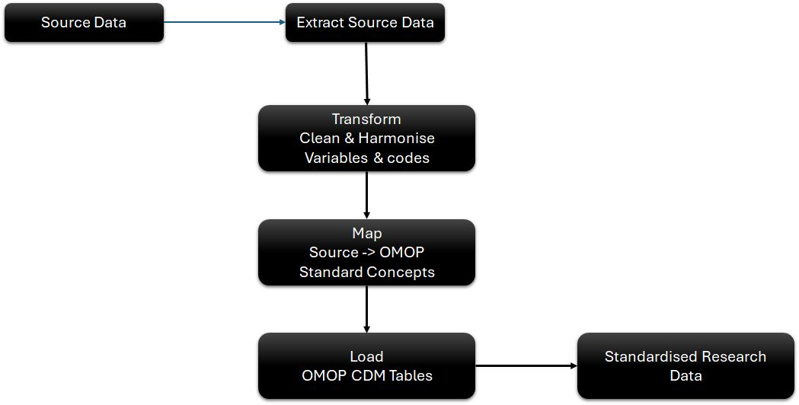
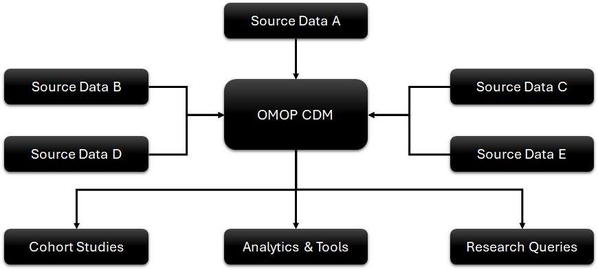
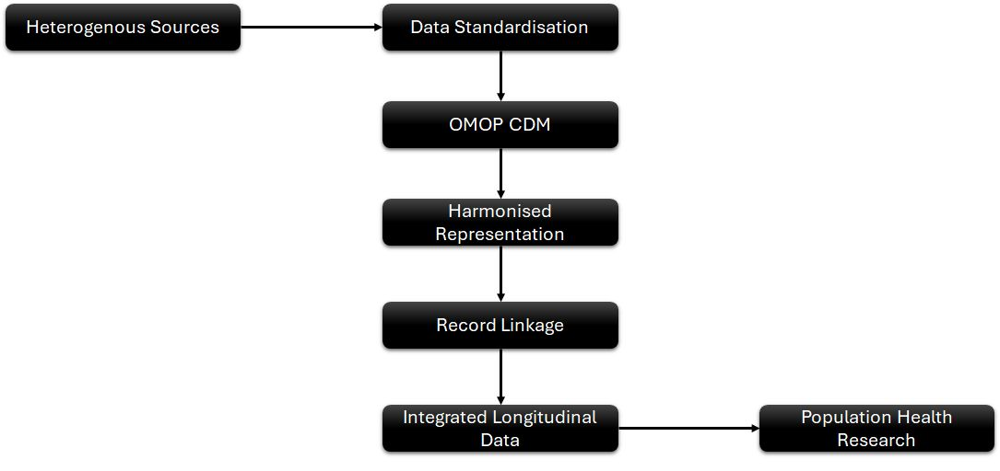

<h1>Record Linkage Using Machine Learning Techniques</h1>

<b>
A reproducible research workflow for synthetic data generation, longitudinal data preparation, and machine learning–based record linkage
</b>  

📌<b> Overview</b>
  
<B>Record linkage</B> is the process of determining whether records from different datasets refer to the same underlying individual or entity.
  
This repository presents a research-oriented workflow for developing and evaluating <b>>machine learning–based record linkage methods, particularly in the context of population health, longitudinal studies, and health and demographic surveillance data</b>.
  
The project follows a synthetic-to-real-data strategy:  

  
The central idea is to <b>develop and validate linkage methodology in a controlled environment before applying it to complex real-world population and health datasets</b>.

 
🎯 <b>Research Objectives</b>  
The repository is designed to investigate the following questions:  
<UL>
<LI>Can realistic synthetic population data be generated while preserving important source-data characteristics?</LI> 
<LI>How can synthetic datasets be used to develop and benchmark record linkage methods?</LI> 
<LI>Which data-quality and similarity features are most informative for identifying matching records?</LI> 
<LI>How can machine learning improve linkage beyond simple deterministic rules?</LI> 
<LI>How can validated linkage approaches be transferred from synthetic data to real-world longitudinal datasets?</LI> 
</UL>

  
🧬 <B>Why Record Linkage?</B>
  
Population health research frequently requires information from multiple data sources.
 
For example:  

 
The quality of downstream epidemiological analyses depends heavily on the quality of this integration.
  
Incorrect linkage can introduce:  
<UL>
<LI>False matches — records belonging to different individuals are linked.</LI> 
<LI>False non-matches — records belonging to the same individual are not linked.</LI> 
<LI>Selection bias — linkage errors are not distributed uniformly across populations.</LI> 
<LI>Loss of longitudinal information — repeated observations may fail to connect.</LI> 
<LI>Reduced statistical power — fragmented records can lead to incomplete trajectories.</LI> 
</UL>

🔬 <B>Methodology</B>
  
<B>1. Longitudinal Data Preparation</B>  
  
The repository includes <B>Pentaho Data Integration (.ktr)</B> transformations for converting source longitudinal data from long format into a structure suitable for subsequent processing.
  
The current repository contains multiple versions of the transformation:
  
The file <B>Converting Long to Wide Format.pdf</B> in the folder <B>01 Convert Source Data From Long to Wide/</B> describes the process of converting the data from Long to Wide
  
This stage provides a reproducible ETL foundation for longitudinal population data. This conversion is only done to convert the records from events to episodes and therefore make it easy for record linkage, as only the individual's details are needed for the purpose. 
  
<B>2. 🔄 Data Standardisation</B>
  
Data standardisation is a foundational component of this research workflow. Population-health, HDSS, clinical, and longitudinal datasets are often collected using different structures, variable definitions, coding systems, and data formats. These differences make it difficult to integrate datasets and perform reliable downstream analyses.
  
This project explores the use of the <B>OMOP Common Data Model (CDM)</B> as a standardised framework for transforming heterogeneous health and population data into a common structure.
  
The objective is to create <B>standardised, interoperable, and research-ready data </B>while preserving the information required for longitudinal analysis and record linkage.
  
<B>OMOP CDM Standardisation Workflow</B> 

  
<B>What is Being Standardised?</B>  
The OMOP CDM provides a common structure and vocabulary framework for representing observational health data.
  
The standardisation process addresses several dimensions of heterogeneous source data:
<TABLE>
   <tr>
      <th>Area</th>
      <th>Standardisation Approach</th>
   </tr>
   <tr>
      <td>Data Structure</td>
      <td>Transform source data into appropriate OMOP CDM tables</td>
   </tr>
      <tr>
      <td>Variable Definitions</td>
      <td>Map source variables to standard OMOP concepts and fields</td>
   </tr>
      <tr>
      <td>Clinical Concepts</td>
      <td>Map local clinical codes to standard OMOP concepts where applicable</td>
   </tr>
      <tr>
      <td>Dates & Times</td>
      <td>Harmonise date and datetime representations</td>
   </tr>
      <tr>
      <td>Demographics</td>
      <td>Standardise person-level demographic information</td>
   </tr>
      <tr>
      <td>Geography</td>
      <td>Harmonise geographic and location-related information</td>
   </tr>
      <tr>
      <td>Identifiers</td>
      <td>Manage source identifiers and person identifiers appropriately</td>
   </tr>
      <tr>
      <td>Observation Periods</td>
      <td>Represent longitudinal periods consistently</td>
   </tr>
      <tr>
      <td>Events</td>
      <td>Organise clinical and observational events according to the CDM structure</td>
   </tr>
      <tr>
      <td>Vocabulary</td>
      <td>Use standardised OMOP vocabularies where appropriate</td>
   </tr>
      <tr>
      <td>Data Quality</td>
      <td>Identify inconsistencies, missing values, invalid values, and structural problems</td>
   </tr>
</TABLE>
  
<B>Source-to-OMOP Transformation</B>
  
The ETL process can be conceptualised as:
 

 
* The data need to be transformed and harmonised before being incorporated into an OMOP-oriented analytical environment.
  
<B>OMOP CDM as an Interoperability Layer</B>
  
One of the major advantages of using the OMOP CDM is that it separates source-specific data structures from the common analytical representation.
 

 
Instead of developing every analysis separately for every source system, data can be transformed into a common representation.
  
This supports:
  
<UL>
<LI>Cross-dataset interoperability</LI> 
<LI>Consistent analytical definitions</LI> 
<LI>Reusable research workflows</LI> 
<LI>Standardised observational research</LI> 
<LI>Cross-site data harmonisation</LI> 
<LI>Improved data quality</LI> 
<LI>More reproducible analyses</LI> 
</UL>
 
<B>OMOP CDM and Record Linkage</B>
  
Data standardisation and record linkage are complementary components of the overall research workflow.
  
Standardisation provides a consistent representation of the data, while record linkage addresses the question of whether observations from different sources correspond to the same underlying individual.
 

 
Importantly, OMOP standardisation does not itself perform record linkage. Instead, it establishes a common data structure and vocabulary that can support subsequent integration, analysis, and linkage workflows.
  
<B>OMOP CDM and Population Health Research</B>  
The standardised data environment can support downstream research activities such as:  
<UL>
<LI>Population-level descriptive analyses</LI> 
<LI>Longitudinal cohort construction</LI> 
<LI>Epidemiological studies</LI> 
<LI>Health outcome research</LI> 
<LI>Cross-site observational research</LI> 
<LI>Data quality assessment</LI> 
<LI>Record linkage and data integration</LI> 
<LI>Reproducible population-health analyses</LI> 
</UL>
 
<B>OMOP Vocabulary Standardisation</B>
  
Where applicable, source-specific codes can be mapped to standard OMOP concepts.
  
The ETL process transforms source data into the OMOP Common Data Model by sequentially mapping native terminology to standardised medical concepts. It begins with Local Source Code, which represents the raw, unstandardised clinical data in its native format (such as local lab codes or proprietary diagnoses). This data is then extracted to construct the Source Vocabulary, cataloging all unique native terms used within the source database. Next, Vocabulary Mapping takes place, utilising tools like USAGI or standardised crosswalks to systematically translate each native source term into its corresponding Standard OMOP Concept within the OHDSI standardised vocabularies (e.g., SNOMED CT for conditions or RxNorm for medications). Finally, these standardised concepts, along with their structured domain attributes, are loaded into the target OMOP CDM tables, completing the transition from disparate local data to a globally unified, analytics-ready schema.
  
This vocabulary standardisation is particularly important when combining information from multiple systems that use different coding schemes.
  
<B>Data Quality Before and After ETL</B>
  
An important part of the standardisation workflow is documenting data-quality issues before and after transformation. 
Examples include:
  
<UL>
<LI>Missing demographic information</LI> 
<LI>Invalid dates</LI> 
<LI>Inconsistent categorical values</LI> 
<LI>Duplicate records</LI> 
<LI>Inconsistent identifiers</LI> 
<LI>Unmapped source codes</LI> 
<LI>Invalid concept mappings</LI> 
<LI>Unexpected values</LI> 
<LI>Inconsistent geographic classifications</LI> 
</UL>
 
The goal is not simply to move data into OMOP tables, but to create a well-documented and quality-assessed research dataset.
  
<B>Role in the Overall Research Pipeline</B>
     
The OMOP CDM data standardisation stage establishes a foundation by converting raw source data into a unified format, which sequentially enables synthetic data generation, validation, and record linkage feature engineering. This structured pipeline then supports machine learning model development for record linkage, rigorous evaluation, and reproducible research—ultimately driving impactful population health applications.
  
The use of OMOP CDM provides a common foundation for transforming heterogeneous population and health data into interoperable, research-ready datasets suitable for reproducible observational and population-health research.
  
<B>3. 🧬 Synthetic Data Generation</B>
   
Synthetic data generation is a central component of this research workflow. It provides a controlled environment for developing and evaluating record linkage methods while reducing the need to expose identifiable individual-level population data during methodological development.
  
The project explores <B>CTGAN (Conditional Tabular Generative Adversarial Network)</B> for generating synthetic tabular population data while attempting to preserve important characteristics of the underlying source data.
  
The current experiments focus particularly on demographic, geographic, and date-related variables that may subsequently contribute to record linkage.
  
<B>Variables Considered</B>
  
The synthetic-data experiments include distributions for:
<UL>
<LI>Date of birth — day</LI> 
<LI>Date of birth — month</LI> 
<LI>Date of birth — year</LI> 
<LI>Sex</LI> 
<LI>Village</LI> 
<LI>Sub-village</LI> 
</UL>
 
The repository contains separate CTGAN experiments, including an experiment specifically designed to investigate <B>well-distributed Date-of-Birth</B> data. The generated outputs include distribution plots, HTML analysis, PDF reports, and comparison results.

 
<B>Why Synthetic Data?</B>  
Synthetic data is particularly useful for this research because record linkage requires controlled experiments in which the researcher can understand the underlying relationships between records.
  
It provides opportunities to:
  
<UL>
<LI>Develop methodology without exposing identifiable records.</LI> 
<LI>Create controlled matching and non-matching scenarios.</LI> 
<LI>Introduce realistic data variation.</LI> 
<LI>Investigate the effect of missing or inconsistent information.</LI> 
<LI>Benchmark alternative linkage approaches.</LI> 
<LI>Repeat experiments under controlled conditions.</LI> 
<LI>Study the behaviour of linkage methods at different scales.</LI> 
</UL>
 
