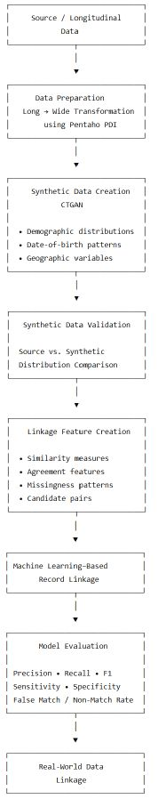
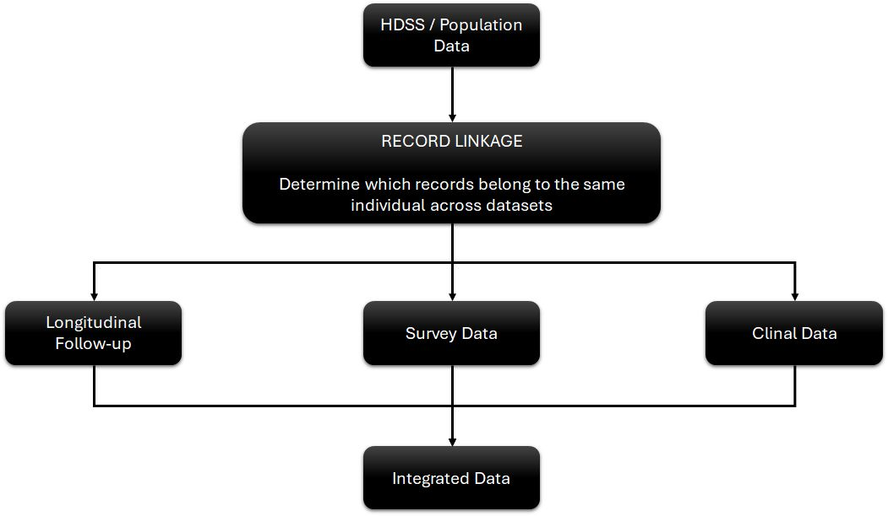
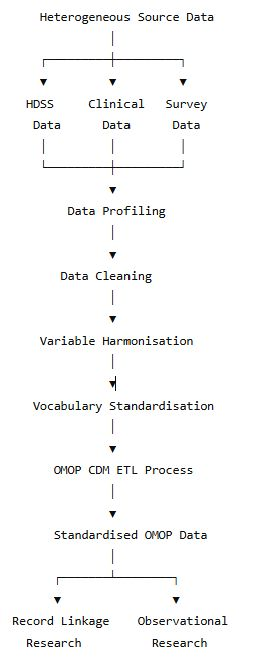
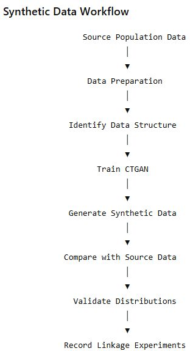

<h1>Record Linkage Using Machine Learning Techniques</h1>

<b>
A reproducible research workflow for synthetic data generation, longitudinal data preparation, and machine learning–based record linkage
</b>  

📌<b> Overview</b>
  
<B>Record linkage</B> is the process of determining whether records from different datasets refer to the same underlying individual or entity.
  
This repository presents a research-oriented workflow for developing and evaluating <b>>machine learning–based record linkage methods, particularly in the context of population health, longitudinal studies, and health and demographic surveillance data</b>.
  
The project follows a synthetic-to-real-data strategy:  

  
The central idea is to <b>develop and validate linkage methodology in a controlled environment before applying it to complex real-world population and health datasets</b>.

 
🎯 <b>Research Objectives</b>  
The repository is designed to investigate the following questions:  
<UL>
<LI>Can realistic synthetic population data be generated while preserving important source-data characteristics?</LI> 
<LI>How can synthetic datasets be used to develop and benchmark record linkage methods?</LI> 
<LI>Which data-quality and similarity features are most informative for identifying matching records?</LI> 
<LI>How can machine learning improve linkage beyond simple deterministic rules?</LI> 
<LI>How can validated linkage approaches be transferred from synthetic data to real-world longitudinal datasets?</LI> 
</UL>

  
🧬 <B>Why Record Linkage?</B>
  
Population health research frequently requires information from multiple data sources.
 
For example:  

 
The quality of downstream epidemiological analyses depends heavily on the quality of this integration.
  
Incorrect linkage can introduce:  
<UL>
<LI>False matches — records belonging to different individuals are linked.</LI> 
<LI>False non-matches — records belonging to the same individual are not linked.</LI> 
<LI>Selection bias — linkage errors are not distributed uniformly across populations.</LI> 
<LI>Loss of longitudinal information — repeated observations may fail to connect.</LI> 
<LI>Reduced statistical power — fragmented records can lead to incomplete trajectories.</LI> 
</UL>

🔬 <B>Methodology</B>
  
<B>1. Longitudinal Data Preparation</B>  
  
The repository includes <B>Pentaho Data Integration (.ktr)</B> transformations for converting source longitudinal data from long format into a structure suitable for subsequent processing.
  
The current repository contains multiple versions of the transformation:
  
The file <B>Converting Long to Wide Format.pdf</B> in the folder <B>01 Convert Source Data From Long to Wide/</B> describes the process of converting the data from Long to Wide
  
This stage provides a reproducible ETL foundation for longitudinal population data. This conversion is only done to convert the records from events to episodes and therefore make it easy for record linkage, as only the individual's details are needed for the purpose. 
  
<B>2. 🔄 Data Standardisation</B>
  
Data standardisation is a foundational component of this research workflow. Population-health, HDSS, clinical, and longitudinal datasets are often collected using different structures, variable definitions, coding systems, and data formats. These differences make it difficult to integrate datasets and perform reliable downstream analyses.
  
This project explores the use of the <B>OMOP Common Data Model (CDM)</B> as a standardised framework for transforming heterogeneous health and population data into a common structure.
  
The objective is to create <B>standardised, interoperable, and research-ready data </B>while preserving the information required for longitudinal analysis and record linkage.
  
<B>OMOP CDM Standardisation Workflow</B> 

  
<B>3. 🧬 Synthetic Data Generation</B>
   
Synthetic data generation is a central component of this research workflow. It provides a controlled environment for developing and evaluating record linkage methods while reducing the need to expose identifiable individual-level population data during methodological development.
  
The project explores <B>CTGAN (Conditional Tabular Generative Adversarial Network)</B> for generating synthetic tabular population data while attempting to preserve important characteristics of the underlying source data.
  
The current experiments focus particularly on demographic, geographic, and date-related variables that may subsequently contribute to record linkage.
  
<B>Variables Considered</B>
  
The synthetic-data experiments include distributions for:
<UL>
<LI>Date of birth — day</LI> 
<LI>Date of birth — month</LI> 
<LI>Date of birth — year</LI> 
<LI>Sex</LI> 
<LI>Village</LI> 
<LI>Sub-village</LI> 
</UL>
 
The repository contains separate CTGAN experiments, including an experiment specifically designed to investigate <B>well-distributed Date-of-Birth</B> data. The generated outputs include distribution plots, HTML analysis, PDF reports, and comparison results.

 
<B>Why Synthetic Data?</B>  
Synthetic data is particularly useful for this research because record linkage requires controlled experiments in which the researcher can understand the underlying relationships between records.
  
It provides opportunities to:
  
<UL>
<LI>Develop methodology without exposing identifiable records.</LI> 
<LI>Create controlled matching and non-matching scenarios.</LI> 
<LI>Introduce realistic data variation.</LI> 
<LI>Investigate the effect of missing or inconsistent information.</LI> 
<LI>Benchmark alternative linkage approaches.</LI> 
<LI>Repeat experiments under controlled conditions.</LI> 
<LI>Study the behaviour of linkage methods at different scales.</LI> 
</UL>
 
